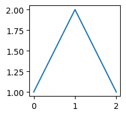
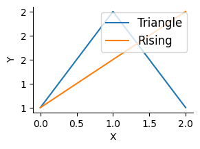

# safepython


<!-- WARNING: THIS FILE WAS AUTOGENERATED! DO NOT EDIT! -->

``` python
from fastcore.test import test_eq, test_fail
```

## Helpers and setup

[`_find_frame_dict`](https://AnswerDotAI.github.io/safepyrun/core.html#_find_frame_dict)
walks the call stack looking for a frame whose globals contain
`sentinel`. This lets
[`RunPython`](https://AnswerDotAI.github.io/safepyrun/core.html#runpython)
find the caller’s namespace without requiring an explicit globals dict.
If no sentinel is found, it falls back to its own module globals.

``` python
_test_sentinel = True
d = _find_frame_dict('_test_sentinel')
assert '_test_sentinel' in d
d2 = _find_frame_dict('nonexistent_sentinel_xyz')
assert d2 is not None
```

------------------------------------------------------------------------

<a
href="https://github.com/AnswerDotAI/safepyrun/blob/main/safepyrun/core.py#L57"
target="_blank" style="float:right; font-size:smaller">source</a>

### find_var

``` python

def find_var(
    var:str
):

```

*Search for var in all frames of the call stack*

``` python
find_var('_test_sentinel')
```

    True

When `ok_dests` is set,
[`_get_write_policy`](https://AnswerDotAI.github.io/safepyrun/core.html#_get_write_policy)
walks the MRO looking for tuple entries, and `_safe_getattr` wraps
matching callables with
[`_AllowChecked`](https://AnswerDotAI.github.io/safepyrun/core.html#_allowchecked)
to enforce destination validation before the call.

``` python
allow({str: [('test_method', AllowPolicy())]})
assert any(isinstance(x, tuple) and x[0] == 'test_method' for x in __pytools__[str])
__pytools__[str].discard(('test_method', AllowPolicy()))
```

------------------------------------------------------------------------

<a
href="https://github.com/AnswerDotAI/safepyrun/blob/main/safepyrun/core.py#L64"
target="_blank" style="float:right; font-size:smaller">source</a>

### allow_write_types

``` python

def allow_write_types(
    types:VAR_POSITIONAL
):

```

*Allow in-place mutation of instances of these types (and their
subclasses via isinstance)*

[`_AllowChecked`](https://AnswerDotAI.github.io/safepyrun/core.html#_allowchecked)
wraps a method so that its `WritePolicy` is enforced before the actual
call. Returned by `_safe_getattr` when a callable matches a
`__pytools_write__` entry and `ok_dests` is set.

``` python
wc = _AllowChecked(Path('/tmp'), Path.exists, PathWritePolicy(), ['/tmp'])
assert callable(wc)
wc2 = _AllowChecked(Path('/etc'), Path('/etc').exists, PathWritePolicy(), ['/tmp'])
try: wc2()
except PermissionError: print("AllowChecked correctly blocked /etc")
```

    AllowChecked correctly blocked /etc

[`_safe_open`](https://AnswerDotAI.github.io/safepyrun/core.html#_safe_open)
returns a closure that checks `OpenWritePolicy` before delegating to the
real `open`. Only injected into the sandbox builtins when `ok_dests` is
set — otherwise the default `open` (which is already excluded from
`all_builtins`) is not available.

``` python
so = _safe_open(['/tmp'])
f = so('/tmp/test_safe_open.txt', 'w')
f.write('test'); f.close()
so('/etc/passwd', 'r').close()
try: so('/etc/bad.txt', 'w')
except PermissionError: print("_safe_open correctly blocked write to /etc")
```

    _safe_open correctly blocked write to /etc

## Builtins and wrappers

------------------------------------------------------------------------

<a
href="https://github.com/AnswerDotAI/safepyrun/blob/main/safepyrun/core.py#L109"
target="_blank" style="float:right; font-size:smaller">source</a>

### sdir

``` python

def sdir(
    o
):

```

*Call self as a function.*

`all_builtins` merges RestrictedPython’s `safe_builtins`,
`utility_builtins`, `limited_builtins`, and async support, then adds the
core container types (`dict`, `list`, `set`, `tuple`, `frozenset`) and
`__import__`. This is the builtins dict passed to the sandbox — anything
not in here is inaccessible as a builtin.

``` python
assert all_builtins['dict'] is dict
assert all_builtins['list'] is list
assert '__import__' in all_builtins
assert 'eval' not in all_builtins
assert 'exec' not in all_builtins
list(all_builtins.keys())[:5]
```

    ['__build_class__', 'None', 'False', 'True', 'abs']

[`_cls_ok`](https://AnswerDotAI.github.io/safepyrun/core.html#_cls_ok)
checks at access time by walking the object and its MRO.
[`_name_in`](https://AnswerDotAI.github.io/safepyrun/core.html#_name_in)
handles both plain strings and tuple entries.

[`_get_policy`](https://AnswerDotAI.github.io/safepyrun/core.html#_get_policy)
extracts a `WritePolicy` from a tuple entry if present.

[`_get_write_policy`](https://AnswerDotAI.github.io/safepyrun/core.html#_get_write_policy)
walks an object’s MRO looking for a `(name, WritePolicy)` tuple entry in
`__pytools__`. Returns the policy if found, else `None`.

[`_make_safe_getattr`](https://AnswerDotAI.github.io/safepyrun/core.html#_make_safe_getattr)
returns a closure over `ok_dests` that intercepts every attribute
access. For callables, it checks `__pytools__` for a write policy first
(wrapping with
[`_AllowChecked`](https://AnswerDotAI.github.io/safepyrun/core.html#_allowchecked)
if matched), then falls back to
[`_cls_ok`](https://AnswerDotAI.github.io/safepyrun/core.html#_cls_ok)
and the `__llmtools__` allow-set. Non-callables pass through unchecked.

``` python
allow({str: ['zfill']})
```

``` python
ga = _make_safe_getattr(ok_dests=['/tmp'])
assert ga('hello', 'zfill')(10) == '00000hello'
```

[`_DirectPrint`](https://AnswerDotAI.github.io/safepyrun/core.html#_directprint)
is a no-op wrapper that RestrictedPython’s `_print_` and `_print` hooks
delegate to. It simply calls the real `print`, bypassing
RestrictedPython’s default print interception.

[`_callable_ok`](https://AnswerDotAI.github.io/safepyrun/core.html#_callable_ok)
checks whether a callable should be allowed — it’s ok if it’s in
`__llmtools__`, is a key in `__pytools__`, or its module has its
`__qualname__` registered via
[`_cls_ok`](https://AnswerDotAI.github.io/safepyrun/core.html#_cls_ok).

``` python
uc = _ReadOnlyCallable(len)
assert repr(uc) == repr(len)
with expect_fail(PermissionError): uc([1,2,3])
```

------------------------------------------------------------------------

<a
href="https://github.com/AnswerDotAI/safepyrun/blob/main/safepyrun/core.py#L202"
target="_blank" style="float:right; font-size:smaller">source</a>

### SafeTransformer

``` python

def SafeTransformer(
    errors:NoneType=None, warnings:NoneType=None, used_names:NoneType=None
):

```

*A :class:`NodeVisitor` subclass that walks the abstract syntax tree
and* allows modification of nodes.

The `NodeTransformer` will walk the AST and use the return value of the
visitor methods to replace or remove the old node. If the return value
of the visitor method is `None`, the node will be removed from its
location, otherwise it is replaced with the return value. The return
value may be the original node in which case no replacement takes place.

Here is an example transformer that rewrites all occurrences of name
lookups (`foo`) to `data['foo']`::

class RewriteName(NodeTransformer):

       def visit_Name(self, node):
           return Subscript(
               value=Name(id='data', ctx=Load()),
               slice=Constant(value=node.id),
               ctx=node.ctx
           )

Keep in mind that if the node you’re operating on has child nodes you
must either transform the child nodes yourself or call the
:meth:`generic_visit` method for the node first.

For nodes that were part of a collection of statements (that applies to
all statement nodes), the visitor may also return a list of nodes rather
than just a single node.

Usually you use the transformer like this::

node = YourTransformer().visit(node)

[`SafeTransformer`](https://AnswerDotAI.github.io/safepyrun/core.html#safetransformer)
extends RestrictedPython’s `RestrictingNodeTransformer` to rewrite
attribute access. Loads become `_getattr_(obj, name)` calls (enabling
callable checks), stores/deletes become `_write_(obj).attr = val`
(enabling mutation control). Private attrs (starting with `_`) are
blocked except for a curated `ALLOWED_DUNDERS` set. It enables
annotation assignments like `class a: b:int`.

## Main implementation

``` python
assert _safe_type(42) is int
assert _safe_type('hi') is str

assert isinstance(int, _safe_type)
assert isinstance(str, _safe_type)
assert not isinstance(42, _safe_type)

with expect_fail(): _safe_type('Foo', (object,), {})
```

------------------------------------------------------------------------

<a
href="https://github.com/AnswerDotAI/safepyrun/blob/main/safepyrun/core.py#L246"
target="_blank" style="float:right; font-size:smaller">source</a>

### should_export

``` python

def should_export(
    k, v, g
):

```

*True if sandbox local `k` with value `v` should be exported back to
caller globals `g`*

------------------------------------------------------------------------

<a
href="https://github.com/AnswerDotAI/safepyrun/blob/main/safepyrun/core.py#L253"
target="_blank" style="float:right; font-size:smaller">source</a>

### srcfn

``` python

def srcfn(
    src
):

```

*Stores src in linecache under \<pyrun\_{i%10}\>, returns the name.*

``` python
srcfn(''),srcfn('')
```

    ('<pyrun_0>', '<pyrun_1>')

[`_run_python`](https://AnswerDotAI.github.io/safepyrun/core.html#_run_python)
is the core sandbox executor. It compiles code with
[`SafeTransformer`](https://AnswerDotAI.github.io/safepyrun/core.html#safetransformer),
sets up the restricted globals (builtins, getattr hook, tools), handles
the last-expression-as-return-value pattern, captures stdout/stderr, and
exports locals back to the caller’s namespace (unless they’d shadow an
existing callable or module; `_`-suffixed names always export).

------------------------------------------------------------------------

<a
href="https://github.com/AnswerDotAI/safepyrun/blob/main/safepyrun/core.py#L302"
target="_blank" style="float:right; font-size:smaller">source</a>

### RunPython

``` python

def RunPython(
    g:NoneType=None, sentinel:NoneType=None, ok_dests:Unset=UNSET
):

```

*Initialize self. See help(type(self)) for accurate signature.*

[`RunPython`](https://AnswerDotAI.github.io/safepyrun/core.html#runpython)
is the public API. It captures the caller’s globals via
[`_find_frame_dict`](https://AnswerDotAI.github.io/safepyrun/core.html#_find_frame_dict),
optionally takes `ok_dests` for write-checking, and generates its
docstring dynamically from the current `__llmtools__|__pytools__` set so
the LLM always sees an up-to-date tool list.

``` python
pyrun = RunPython()
```

``` python
await pyrun('[]')
```

    []

------------------------------------------------------------------------

<a
href="https://github.com/AnswerDotAI/safepyrun/blob/main/safepyrun/core.py#L343"
target="_blank" style="float:right; font-size:smaller">source</a>

### create_pyrun_magic

``` python

def create_pyrun_magic(
    shell:NoneType=None, pyrun:NoneType=None
):

```

*Create magic*

``` python
create_pyrun_magic()
```

``` python
print('tt')
```

    tt

``` python
type('t')
```

    str

``` python
a = 1
a+=2
a
```

    3

Unpacking is allowed:

``` python
a = [1,2,3]
print(*a)
```

    1 2 3

``` python
@allow
def f(): warnings.warn('a warning')
```

``` python
print("asdf")
f()
1+1
```

    asdf

    /tmp/ipykernel_15759/2295904293.py:2: UserWarning: a warning
      def f(): warnings.warn('a warning')

    2

Classes and functions can be created:

``` python
await pyrun('''
class A:
    def __init__(self): print('safe')
_ = A()''')
```

    safe

``` python
await pyrun('class a: b:int')
```

``` python
await pyrun('''
def f(): print('safe')
f()''')
```

    safe

``` python
try: await pyrun('os.system("ls")')
except Exception as e: traceback.print_exception(e)
```

    Traceback (most recent call last):
      File "/tmp/ipykernel_15759/3414206815.py", line 1, in <module>
        try: await pyrun('os.system("ls")')
             ^^^^^^^^^^^^^^^^^^^^^^^^^^^^^^
      File "/tmp/ipykernel_15759/636843653.py", line 37, in __call__
        raise e.with_traceback(tb) from None
      File "<pyrun_5>", line 1, in <module>
        os.system('ls')
        ~~~~~~~~~^^^^^^
      File "/tmp/ipykernel_15759/1745616310.py", line 16, in __call__
        raise PermissionError(f"Calling {type(object.__getattribute__(self, '_obj')).__name__} not allowed in sandbox")
    PermissionError: Calling builtin_function_or_method not allowed in sandbox

Unsafe code inside functions and classes is caught:

``` python
with expect_fail(PermissionError):
    await pyrun('''
class A:
    def __init__(self): os.unlink('/unsafe')
A()''')
```

``` python
with expect_fail(PermissionError):
    await pyrun('''
def f(): os.unlink('/unsafe')
f()''')
```

``` python
print(os.unlink)
```

    <built-in function unlink>

``` python
print(type(os.unlink))
```

    <class '__main__._ReadOnlyCallable'>

``` python
print(os.unlink.__qualname__)
```

    unlink

Readonly callable types are still treated as instances of `type`:

``` python
class C: ...
c = C()
```

``` python
isinstance(C, type)
```

    True

``` python
isinstance(c, type)
```

    False

`__pytools_write_types__` controls which object types can be mutated
in-place (e.g. `d[k] = v`).
[`allow_write_types`](https://AnswerDotAI.github.io/safepyrun/core.html#allow_write_types)
registers types; subclasses are automatically covered via `isinstance`.
[`_default_write_`](https://AnswerDotAI.github.io/safepyrun/core.html#_default_write_)
is the guard injected into the sandbox as `_write_` — it’s called by
[`SafeTransformer`](https://AnswerDotAI.github.io/safepyrun/core.html#safetransformer)-compiled
code whenever an attribute store or item assignment occurs. It returns a
[`_WriteGuard`](https://AnswerDotAI.github.io/safepyrun/core.html#_writeguard)
proxy that:

- Blocks setting attributes to callables (prevents injecting functions
  into objects)
- Blocks mutation of globals/frame dicts (detected by checking for
  `__builtins__` key)
- Allows normal item and attribute assignment/deletion otherwise

The sandbox has two independent mutation gates:

- **`_write_`** guards **syntax-level** mutations — item/attribute
  assignment and deletion (e.g. `d["x"] = 1`, `del obj.attr`). The AST
  transformer rewrites these to call `_write_(obj)`, which checks
  `__pytools_write_types__` and returns a
  [`_WriteGuard`](https://AnswerDotAI.github.io/safepyrun/core.html#_writeguard).
  Register types with `allow_write_types(dict, list, ...)`.

- **`_getattr_`** guards **method-level** mutations — calling mutating
  methods like `.append()`, `.pop()`, `.update()`. These go through the
  callable access check (`__pytools__`, `__llmtools__`). Allow policies
  stored as `(name, AllowPolicy)` tuples in `__pytools__` additionally
  enforce destination checking when `ok_dests` is set.

Nothing registered by default — all writes blocked

``` python
o = SimpleNamespace(x=1)

with expect_fail(PermissionError): await pyrun('d = {}; d["x"] = 1')
with expect_fail(PermissionError): await pyrun('o.x = 2')
with expect_fail(PermissionError): await pyrun('d = {"a":1}; del d["a"]')
with expect_fail(PermissionError): await pyrun('del o.x')
```

With
[`allow_write_types`](https://AnswerDotAI.github.io/safepyrun/core.html#allow_write_types)
they are allowed:

``` python
await pyrun('''
d = {}
d["x"] = 1
o.x = 2
d["x"],o.x''')
```

    (1, 2)

References to methods can be `allow`ed too:

``` python
class A:
    def echo(self,x):print(x)
echo=A().echo

allow(echo)
await pyrun("echo('tst')")
```

    tst

## Standard allows

## Config

`safepyrun` loads an optional user config from
`{xdg_config_home}/safepyrun/config.py` at import time, after all
defaults are registered. This lets users permanently extend the sandbox
allowlists without modifying the package. The config file is executed
with all `safepyrun.core` globals already available — no imports needed.
This includes `allow`,
[`allow_write_types`](https://AnswerDotAI.github.io/safepyrun/core.html#allow_write_types),
`AllowPolicy`, `PathWritePolicy`, `PosAllowPolicy`, `OpenWritePolicy`,
and all standard library modules already imported by the module.

Example `~/.config/safepyrun/config.py` (Linux) or
`~/Library/Application Support/safepyrun/config.py` (macOS):

``` python
# Add pandas tools
allow({pandas.DataFrame: ['head', 'describe', 'info', 'shape']})

# Allow writing to ~/data with policy
allow({Path: [('write_text', PathWritePolicy())]})
```

If the config file has errors, a warning is emitted and the defaults
remain intact.

## Examples

``` python
a = {"b":1}
list(a.items())
```

    [('b', 1)]

``` python
Path().exists()
```

    True

``` python
os.path.join('/foo', 'bar', 'baz.py')
```

    '/foo/bar/baz.py'

``` python
a_=3
```

``` python
a_
```

    3

``` python
aa_='33'
```

``` python
len(aa_)
```

    2

``` python
def g(): ...
```

``` python
inspect.getsource(g)
```

    'def g(): ...\n'

``` python
with expect_fail(PermissionError): await pyrun('g()')
with expect_fail(PermissionError): await pyrun("os.unlink('/foo/bar')")
```

``` python
re.compile("a")
```

    re.compile(r'a', re.UNICODE)

``` python
from re import compile
```

``` python
compile("a")
```

    re.compile(r'a', re.UNICODE)

``` python
async def agen():
    for x in [1,2]: yield x
res = []
async for x in agen(): res.append(x)
res
```

    [1, 2]

``` python
import asyncio
async def fetch(n): return n * 10
print(string.ascii_letters)
await asyncio.gather(fetch(1), fetch(2), fetch(3))
```

    <coroutine object InteractiveShell.run_cell_magic>

``` python
import numpy as np
```

``` python
allow({np: ['array'], np.ndarray: ['sum']})
```

``` python
import numpy as np; np.array([1,2,3]).sum()
```

    6

### Allow policy examples

``` python
pyrun2 = RunPython(ok_dests=['/tmp'])
```

``` python
await pyrun2("Path('/tmp/test_write.txt').write_text('hello')")
```

    5

``` python
try: await pyrun2("Path('/etc/evil.txt').write_text('bad')")
except PermissionError as e: print(f'Blocked: {e}')
```

    Blocked: Dest '/etc/evil.txt' not allowed; permitted: ['/tmp']

``` python
await pyrun2("open('/tmp/test_open.txt', 'w').write('hi')")
```

    2

``` python
try: await pyrun2("open('/root/bad.txt', 'w')")
except PermissionError as e: print(f'Blocked: {e}')
```

    Blocked: Dest '/root/bad.txt' not allowed; permitted: ['/tmp']

``` python
await pyrun2("open('/etc/passwd', 'r').read(10)")
```

    '##\n# User '

``` python
await pyrun2("import shutil; shutil.copy('/tmp/test_write.txt', '/tmp/test_copy.txt')")
```

    '/tmp/test_copy.txt'

``` python
try: await pyrun2("import shutil; shutil.copy('/tmp/test_write.txt', '/root/bad.txt')")
except PermissionError as e: print(f'Blocked: {e}')
```

    Blocked: Dest '/root/bad.txt' not allowed; permitted: ['/tmp']

``` python
try: await pyrun("Path('/tmp/test.txt').write_text('nope')")
except AttributeError as e: print(f'No ok_dests: {e}')
```

``` python
pyrun_cwd = RunPython(ok_dests=['.'])

# Writing to cwd should work
await pyrun_cwd("Path('test_cwd_ok.txt').write_text('hello')")
```

    5

``` python
Path('test_cwd_ok.txt').unlink(missing_ok=True)
```

``` python
# Writing to /tmp should be blocked (not in ok_dests)
try: await pyrun_cwd("Path('/tmp/nope.txt').write_text('bad')")
except PermissionError: print("Blocked /tmp as expected")
```

    Blocked /tmp as expected

``` python
# Parent traversal should be blocked
try: await pyrun_cwd("Path('../escape.txt').write_text('bad')")
except PermissionError: print("Blocked ../ as expected")
```

    Blocked ../ as expected

``` python
# Sneaky traversal via subdir/../../ should also be blocked
try: await pyrun_cwd("Path('subdir/../../escape.txt').write_text('bad')")
except PermissionError: print("Blocked subdir/../../ as expected")
```

    Blocked subdir/../../ as expected

``` python
try: await pyrun_cwd("open('../bad_open.txt', 'w')")
except PermissionError: print("Blocked open ../ as expected")
```

    Blocked open ../ as expected

## Plots

------------------------------------------------------------------------

<a
href="https://github.com/AnswerDotAI/safepyrun/blob/main/safepyrun/core.py#L418"
target="_blank" style="float:right; font-size:smaller">source</a>

### allow_matplotlib

``` python

def allow_matplotlib(
    
):

```

*Call self as a function.*

``` python
import matplotlib.pyplot as plt
from matplotlib.figure import Figure
from matplotlib.axes import Axes
from matplotlib.axis import Axis
from matplotlib.spines import Spine, SpinesProxy
```

``` python
allow_matplotlib()
```

``` python
plt.figure(figsize=(2,2))
plt.plot([1,2,1]);
```



``` python
fig, ax = plt.subplots(figsize=(3,2))
ax.plot([1,2,1], label='Triangle')
ax.plot([1,1.5,2], label='Rising')
ax.tick_params(labelsize=10)
ax.set_xlabel('X', fontsize=10)
ax.set_ylabel('Y', fontsize=10)
ax.spines[['top','right']].set_visible(False)
ax.yaxis.set_major_formatter('{x:.0f}')
ax.legend(fontsize=12);
```



------------------------------------------------------------------------

<a
href="https://github.com/AnswerDotAI/safepyrun/blob/main/safepyrun/core.py#L442"
target="_blank" style="float:right; font-size:smaller">source</a>

### load_ipython_extension

``` python

def load_ipython_extension(
    ip
):

```

*Call self as a function.*

------------------------------------------------------------------------

<a
href="https://github.com/AnswerDotAI/safepyrun/blob/main/safepyrun/core.py#L453"
target="_blank" style="float:right; font-size:smaller">source</a>

### cli

``` python

def cli(
    path:str <Path to script, or '-' for stdin>
):

```

*Run a python script file in the safepyrun sandbox*
