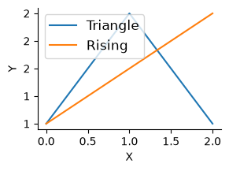

# safepython


<!-- WARNING: THIS FILE WAS AUTOGENERATED! DO NOT EDIT! -->

``` python
from fastcore.test import expect_fail,test_eq
from fastcore.test import test_eq, test_fail
import string
```

## Helpers and setup

[`_find_frame_dict`](https://AnswerDotAI.github.io/safepyrun/core.html#_find_frame_dict)
walks the call stack looking for a frame whose globals contain
`sentinel`. This lets
[`RunPython`](https://AnswerDotAI.github.io/safepyrun/core.html#runpython)
find the caller’s namespace without requiring an explicit globals dict.
If no sentinel is found, it falls back to its own module globals.

``` python
_test_sentinel = True
d = _find_frame_dict('_test_sentinel')
assert '_test_sentinel' in d
d2 = _find_frame_dict('nonexistent_sentinel_xyz')
assert d2 is not None
```

------------------------------------------------------------------------

<a
href="https://github.com/AnswerDotAI/safepyrun/blob/main/safepyrun/core.py#L43"
target="_blank" style="float:right; font-size:smaller">source</a>

### find_var

``` python

def find_var(
    var:str
):

```

*Search for var in all frames of the call stack*

``` python
find_var('_test_sentinel')
```

    True

## Builtins and wrappers

------------------------------------------------------------------------

<a
href="https://github.com/AnswerDotAI/safepyrun/blob/main/safepyrun/core.py#L55"
target="_blank" style="float:right; font-size:smaller">source</a>

### freeze_mon_policy

``` python

def freeze_mon_policy(
    p
):

```

*Freeze monitoring policy for one run*

`mon_disable_policy` is mutable module-level configuration for cheap
`sys.monitoring` DISABLE decisions.
[`freeze_mon_policy`](https://AnswerDotAI.github.io/safepyrun/core.html#freeze_mon_policy)
snapshots it for a single run so policy checks are stable while code
executes.

------------------------------------------------------------------------

<a
href="https://github.com/AnswerDotAI/safepyrun/blob/main/safepyrun/core.py#L65"
target="_blank" style="float:right; font-size:smaller">source</a>

### on_call

``` python

def on_call(
    caller, callee, fn, code, off, data, calls
):

```

*Fast monitoring callback to decide if event should be DISABLEd*

[`on_call`](https://AnswerDotAI.github.io/safepyrun/core.html#on_call)
uses only caller/callee names, call pairs, prefixes/suffixes, and
optional predicates to decide whether this call site can be disabled for
performance. Since fastaudit raises audit events for sys.monitoring
c-call events, they can also be checked there when args/kwargs policy
checks are needed.

------------------------------------------------------------------------

<a
href="https://github.com/AnswerDotAI/safepyrun/blob/main/safepyrun/core.py#L74"
target="_blank" style="float:right; font-size:smaller">source</a>

### frame_args

``` python

def frame_args(
    fr, obj:NoneType=None
):

```

*Introspection helper used before audit denies an op; check whether it
happened inside an approved call*

Check on a plain function, including normal positional arguments,
keyword-only arguments, and extra `**kwargs`:

``` python
def some_tool(path, text, *, overwrite=False, **kwargs): return frame_args(currentframe())
args,kwargs = some_tool('path', 'text', overwrite=True, a='b')
test_eq(args, ['path', 'text'])
test_eq(kwargs, {'overwrite': True, 'a': 'b'})
```

With methods removes `self` from the returned positional arguments:

``` python
class F:
    def some_meth(self, path, text, *, overwrite=False, **kwargs): return frame_args(currentframe(), self)
args,kwargs = F().some_meth('path', 'text', overwrite=True, a='b')
test_eq(args, ['path', 'text'])
test_eq(kwargs, {'overwrite': True, 'a': 'b'})
```

[`_ctx_check`](https://AnswerDotAI.github.io/safepyrun/core.html#_ctx_check)
checks one pytool registration set for a matching name. It returns
`True` for direct name matches or allow-all (`...`), and for validator
tuples it calls the validator with `(obj, args, kwargs, data)` before
returning. It exists so module, class, tracked-call, and frame-call
checks all share the same validator logic.

[`_call_allowed`](https://AnswerDotAI.github.io/safepyrun/core.html#_call_allowed)
checks one logical
[`CallInfo`](https://AnswerDotAI.github.io/safepyrun/core.html#callinfo)
against the pytool registry. It returns `True` when the call is allowed
either at module level or class/MRO level, including constrained
validator entries. It exists to centralize pytool lookup for both async
tracked calls and stack-frame fallback calls.

[`_ctx_allowed`](https://AnswerDotAI.github.io/safepyrun/core.html#_ctx_allowed)
checks every logical call in a
[`DenyInfo`](https://AnswerDotAI.github.io/safepyrun/core.html#denyinfo).
It returns `True` if any tracked or frame-derived call is registered as
allowed. It exists so
[`before_deny`](https://AnswerDotAI.github.io/safepyrun/core.html#before_deny)
no longer duplicates stack walking or call matching logic.

------------------------------------------------------------------------

<a
href="https://github.com/AnswerDotAI/safepyrun/blob/main/safepyrun/core.py#L127"
target="_blank" style="float:right; font-size:smaller">source</a>

### DenyInfo

``` python

def DenyInfo(
    event, args, frame, msg, data, calls, frame_args
):

```

*Initialize self. See help(type(self)) for accurate signature.*

------------------------------------------------------------------------

<a
href="https://github.com/AnswerDotAI/safepyrun/blob/main/safepyrun/core.py#L121"
target="_blank" style="float:right; font-size:smaller">source</a>

### CallInfo

``` python

def CallInfo(
    fn:NoneType=None, args:tuple=(), kwargs:NoneType=None, module:NoneType=None, qualname:NoneType=None,
    name:NoneType=None, frame:NoneType=None, source:NoneType=None
):

```

*Initialize self. See help(type(self)) for accurate signature.*

------------------------------------------------------------------------

<a
href="https://github.com/AnswerDotAI/safepyrun/blob/main/safepyrun/core.py#L118"
target="_blank" style="float:right; font-size:smaller">source</a>

### RawDenyInfo

``` python

def RawDenyInfo(
    args, frame, msg, calls, frame_args
):

```

*Initialize self. See help(type(self)) for accurate signature.*

[`DenyInfo`](https://AnswerDotAI.github.io/safepyrun/core.html#denyinfo)
is the public object passed to `pre_deny`. It exposes `event`, `data`,
`call`, `args`, `kwargs`, `calls`, `tracked_calls`, and `frame_calls`,
with raw audit details under `raw`. It exists to make policy callbacks
ergonomic while preserving access to lower-level audit information when
needed.

------------------------------------------------------------------------

<a
href="https://github.com/AnswerDotAI/safepyrun/blob/main/safepyrun/core.py#L152"
target="_blank" style="float:right; font-size:smaller">source</a>

### before_deny

``` python

def before_deny(
    event, args, frame, msg, data, calls, pre_deny:NoneType=None, _frame_args:function=frame_args
):

```

*Check whether a possibly-denied audit event happened inside an approved
call.*

[`before_deny`](https://AnswerDotAI.github.io/safepyrun/core.html#before_deny)
is the audit-policy adapter called by `fastaudit`. It builds a
[`DenyInfo`](https://AnswerDotAI.github.io/safepyrun/core.html#denyinfo),
gives `pre_deny(info)` first refusal, then falls back to registered
pytool checks via
[`_ctx_allowed`](https://AnswerDotAI.github.io/safepyrun/core.html#_ctx_allowed).
It returns `True` to allow the audited operation, or `None` to leave it
denied by the audit layer.

Check direct allow-by-name:

``` python
tst_data = dict(pytools={sys.modules[__name__]: {'_bd_allowed'}}, ok_dests=set())
def _bd_allowed(): return before_deny(None, None, currentframe(), None, data=tst_data, calls=[])
def _bd_denied (): return before_deny(None, None, currentframe(), None, data=tst_data, calls=[])

assert _bd_allowed()
assert not _bd_denied()
```

Check the registered method passes its object, recovered args, kwargs,
and allowed destinations:

``` python
_seen = []
def _bd_check(obj, args, kw, data): _seen.append((obj, args, kw, data['ok_dests']))

class _BDT:
    def save(self, path, *, overwrite=False): return before_deny(None, None, currentframe(), None, data=tst_data, calls=[])
tst_data = dict(pytools={_BDT: [('save', _bd_check)]}, ok_dests={'/tmp'})

t = _BDT()
test_eq(t.save('/tmp/x', overwrite=True), True)
test_eq(_seen, [(t, ['/tmp/x'], dict(overwrite=True), {'/tmp'})])
```

## Main implementation

------------------------------------------------------------------------

<a
href="https://github.com/AnswerDotAI/safepyrun/blob/main/safepyrun/core.py#L159"
target="_blank" style="float:right; font-size:smaller">source</a>

### srcfn

``` python

def srcfn(
    src
):

```

*Stores src in linecache under \<pyrun\_{i%10}\>, returns the name.*

``` python
srcfn(''),srcfn('')
```

    ('<pyrun_0>', '<pyrun_1>')

------------------------------------------------------------------------

<a
href="https://github.com/AnswerDotAI/safepyrun/blob/main/safepyrun/core.py#L170"
target="_blank" style="float:right; font-size:smaller">source</a>

### \_\_run_python

``` python

async def __run_python(
    code:str, g:NoneType=None, ok_dests:NoneType=None
):

```

*Call self as a function.*

[`__run_python`](https://AnswerDotAI.github.io/safepyrun/core.html#__run_python)
executes user code with separate globals (`rg`) and locals (`loc`)
mappings. Earlier top-level assignments are written into `loc`. Most
final expressions can still see those names because they are evaluated
with the same locals mapping.

Generator expressions are different: they run in their own nested scope.
When the generator body later resolves a name assigned by an earlier
statement, it looks in the globals mapping (`rg`), not the outer `eval`
locals mapping (`loc`). So code like `x = 10; sum(i+x for i in [1,2])`
failed with `NameError` because `x` was only in `loc`.

After executing the non-final statements, `rg.update(loc)` copies those
assigned names into the globals mapping before evaluating the final
expression. This preserves the notebook-style behavior where names
defined earlier in the cell are visible inside generators,
comprehensions, lambdas, and other nested scopes used by the final
expression.

``` python
await __run_python(
    "rnd_var_name_123 = 10\n"
    "sum(x + rnd_var_name_123 for x in [1, 2])",
    g={}
)
```

    23

[`_run_python`](https://AnswerDotAI.github.io/safepyrun/core.html#_run_python)
builds the per-run policy bundle passed to `fastaudit`, including
approved pytools, allowed destinations, and the frozen monitoring policy
snapshot.

[`_run_python`](https://AnswerDotAI.github.io/safepyrun/core.html#_run_python)
snapshots `asyncio.all_tasks()` before running and waits for any new
tasks (including tasks they spawn in turn) before returning, so a tool
call only completes when all its background work has. If a background
task fails, the tool call raises that error. Tasks spawned by tool code
with `asyncio.create_task` would otherwise outlive the audit context.

``` python
res = []
async def bg_job():
    await asyncio.sleep(0.1)
    res.append('finished')

r = await _run_python("asyncio.create_task(bg_job())\n'returned'", g=dict(asyncio=asyncio, bg_job=bg_job), ok_dests=())
test_eq(r, 'returned')
test_eq(res, ['finished'])  # bg task completed before the call returned
```

``` python
async def bg_bad():
    await asyncio.sleep(0.01)
    subprocess.run(['ls'])
    
with expect_fail(PermissionError, 'subprocess.Popen blocked'):
    await _run_python("asyncio.create_task(bg_bad())", g=dict(asyncio=asyncio, bg_bad=bg_bad), ok_dests=())
```

The helpers a host injects into user globals (pyrun, allow) are never
exported back out of the sandbox, so AI code can’t shadow them with
trojans for the user to run later.

``` python
with expect_fail(PermissionError):
    await _run_python("allow_imports.add('evil')", g={'allow_imports': allow_imports})
allow_imports.discard('evil')
```

AI code can reach the mutable host policy (`__pytools__`,
`allow_imports`, `mon_disable_policy`) by importing this module, and
could loosen it for a later call.
[`_run_python`](https://AnswerDotAI.github.io/safepyrun/core.html#_run_python)
fingerprints that policy before running and raises if it changed by the
time the call finishes, so any in-call tampering fails loudly.

``` python
g = {}
await _run_python("pyrun = 'trojan'\nallow = 'trojan'\nkeep = 42", g=g)
test_eq(g['keep'], 42)
assert 'pyrun' not in g and 'allow' not in g
```

We have some extra rules based on the raw code being run (as opposed to
the code inside the implementations being called): - No imports - No
exec/eval - No defining functions or classes.
[`_check_user_code`](https://AnswerDotAI.github.io/safepyrun/core.html#_check_user_code)
is responsible for these rules.

Some libs (like `httpcore`) wrap our permission errors, so we can’t
handle them directly. We unwrap the error in that situation.

------------------------------------------------------------------------

<a
href="https://github.com/AnswerDotAI/safepyrun/blob/main/safepyrun/core.py#L250"
target="_blank" style="float:right; font-size:smaller">source</a>

### RunPython

``` python

def RunPython(
    g:NoneType=None, sentinel:NoneType=None, ok_dests:Unset=UNSET,
    ban_imports:frozenset=frozenset({'safepyrun', 'socket', 'fastaudit', 'importlib'}), ban_defs:bool=True,
    pre_deny:NoneType=None, kwargs:VAR_KEYWORD
):

```

*Execute Python with audit-hook safety checks and access to LLM tools,
returning last expression.* `import` works in the usual way. All
builtins are available. Multiline code blocks can be used, including
defining functions and variables. **NB**: Locals are exported back to
the caller’s namespace.

[`RunPython`](https://AnswerDotAI.github.io/safepyrun/core.html#runpython)
is the public API. It captures the caller’s globals via
[`_find_frame_dict`](https://AnswerDotAI.github.io/safepyrun/core.html#_find_frame_dict),
optionally takes `ok_dests` for write-checking, and executes code under
the audit-hook policy.

``` python
pyrun = RunPython()
```

``` python
await pyrun('[]')
```

    []

``` python
async def f(): return 1
```

``` python
await pyrun('await f()')
```

    1

Passing an empty dict as the namespace results in a clean environment:

``` python
g = {}
await RunPython(g=g)('_ns_test_var = 42')
test_eq(list(g.keys()), ['_ns_test_var'])
assert '_ns_test_var' not in globals()
```

------------------------------------------------------------------------

<a
href="https://github.com/AnswerDotAI/safepyrun/blob/main/safepyrun/core.py#L280"
target="_blank" style="float:right; font-size:smaller">source</a>

### create_pyrun_magic

``` python

def create_pyrun_magic(
    shell:NoneType=None, pyrun:NoneType=None, g:NoneType=None, sentinel:NoneType=None, ok_dests:Unset=UNSET,
    ban_imports:frozenset=frozenset({'safepyrun', 'socket', 'fastaudit', 'importlib'}), ban_defs:bool=True,
    pre_deny:NoneType=None
):

```

*Create magic*

``` python
create_pyrun_magic()
```

``` python
print('tt')
```

    tt

``` python
type('t')
```

    str

``` python
a = 1
a+=2
a
```

    3

Unpacking is allowed:

``` python
a = [1,2,3]
print(*a)
```

    1 2 3

``` python
def f(): warnings.warn('a warning')
```

``` python
print("asdf")
f()
1+1
```

    asdf

    /var/folders/51/b2_szf2945n072c0vj2cyty40000gn/T/ipymini_64818/3833129470.py:1: UserWarning: a warning
      def f(): warnings.warn('a warning')

    2

Classes and functions can not be created:

``` python
with expect_fail(PermissionError):
    await pyrun('class A:\n    def __init__(self): print("hi")')

with expect_fail(PermissionError):
    await pyrun('def f(): print("hi")')
```

``` python
with expect_fail(PermissionError): await pyrun('os.system("ls")')
```

``` python
print(os.unlink)
print(type(os.unlink))
print(os.unlink.__qualname__)
```

    <built-in function unlink>
    <class 'builtin_function_or_method'>
    unlink

``` python
class C: ...
c = C()
```

``` python
isinstance(C, type)
```

    True

``` python
isinstance(c, type)
```

    False

### `allow_write_types`

``` python
o = SimpleNamespace(x=1)

await pyrun('''
d = {}
d["x"] = 1
o.x = 2
d["x"],o.x''')
```

    (1, 2)

## Config

`safepyrun` loads an optional user config from
`{xdg_config_home}/safepyrun/config.py` at import time, after all
defaults are registered. This lets users permanently extend the sandbox
allowlists without modifying the package. The config file is executed
with all `safepyrun.core` globals already available — no imports needed.
This includes `allow`, `allow_write_types`, `AllowPolicy`,
`PathWritePolicy`, `PosAllowPolicy`, `OpenWritePolicy`, and all standard
library modules already imported by the module.

Example `~/.config/safepyrun/config.py` (Linux) or
`~/Library/Application Support/safepyrun/config.py` (macOS):

``` python
# Add pandas tools
allow({pandas.DataFrame: ['head', 'describe', 'info', 'shape']})
```

If the config file has errors, a warning is emitted and the defaults
remain intact.

## Examples

``` python
a = {"b":1}
list(a.items())
```

    [('b', 1)]

``` python
Path().exists()
```

    True

``` python
os.path.join('/foo', 'bar', 'baz.py')
```

    '/foo/bar/baz.py'

``` python
a_=3
```

``` python
a_
```

    3

``` python
aa_='33'
```

``` python
len(aa_)
```

    2

``` python
def g(): ...
```

``` python
inspect.getsource(g)
```

    'def g(): ...\n'

``` python
with expect_fail(PermissionError): await pyrun("os.unlink('/foo/bar')")
```

``` python
async def agen():
    for x in [1,2]: yield x
```

``` python
res = []
async for x in agen(): res.append(x)
res
```

    [1, 2]

``` python
import asyncio
async def fetch(n): return n * 10
```

``` python
print(string.ascii_letters)
await asyncio.gather(fetch(1), fetch(2), fetch(3))
```

    abcdefghijklmnopqrstuvwxyzABCDEFGHIJKLMNOPQRSTUVWXYZ

    [10, 20, 30]

``` python
import numpy as np
```

``` python
np.array([1,2,3]).sum()
```

    np.int64(6)

### Allow policy examples

``` python
pyrun2 = RunPython(ok_dests=['/tmp'])
```

``` python
await pyrun2("Path('/tmp/test_write.txt').write_text('hello')")
```

    5

``` python
await pyrun2("open('/tmp/test_open.txt', 'w').write('hi')")
```

    2

``` python
with expect_fail(PermissionError): await pyrun2("Path('/etc/evil.txt').write_text('bad')")
with expect_fail(PermissionError): await pyrun2("open('/root/bad.txt', 'w')")
```

``` python
await pyrun2("open('/etc/passwd', 'r').read(10)")
```

    '##\n# User '

``` python
await pyrun2("import shutil; shutil.copy('/tmp/test_write.txt', '/tmp/test_copy.txt')")
```

    '/tmp/test_copy.txt'

``` python
with expect_fail(PermissionError): await pyrun2("import shutil; shutil.copy('/tmp/test_write.txt', '/root/bad.txt')")
with expect_fail(PermissionError): await pyrun("Path('/tmp/test.txt').write_text('nope')")
```

``` python
pyrun_cwd = RunPython(ok_dests=['.'])

# Writing to cwd should work
await pyrun_cwd("Path('test_cwd_ok.txt').write_text('hello')")
```

    5

``` python
with expect_fail(PermissionError): await pyrun("Path('test_cwd_ok.txt').write_text('hello')")
```

``` python
Path('test_cwd_ok.txt').unlink(missing_ok=True)
```

``` python
# Writing to /tmp should be blocked (not in ok_dests)
with expect_fail(PermissionError): await pyrun_cwd("Path('/tmp/nope.txt').write_text('bad')")
```

``` python
# Parent traversal should be blocked
with expect_fail(PermissionError): await pyrun_cwd("Path('../escape.txt').write_text('bad')")
```

``` python
# Sneaky traversal via subdir/../../ should also be blocked
with expect_fail(PermissionError): await pyrun_cwd("Path('subdir/../../escape.txt').write_text('bad')")
```

## `allow`

``` python
class A:
    def f(self): ...

def g(self:A): ...
```

``` python
with expect_fail(PermissionError): await pyrun("patch(g)")
```

``` python
assert await pyrun("patch(g)")
```

``` python
def trusted_echo(): return subprocess.run(['echo', 'hi'], capture_output=True, text=True)
```

``` python
with expect_fail(PermissionError): await pyrun("trusted_echo().stdout")
with expect_fail(PermissionError): await pyrun("import subprocess; subprocess.run(['echo', 'hi'])")
```

``` python
allow(trusted_echo)
test_eq((await pyrun("trusted_echo().stdout")), "hi\n")
with expect_fail(PermissionError): await pyrun("import subprocess; subprocess.run(['echo', 'hi'])")
```

``` python
class _MethT:
    def echo (self): return run('echo hi')
    def echo2(self): return run('echo hi')

t = _MethT()
with expect_fail(PermissionError): await pyrun("t.echo()")
with expect_fail(PermissionError): await pyrun("t.echo2()")
allow(_MethT.echo)
test_eq(await pyrun("t.echo()"), "hi")

allow({_MethT:['echo2']})
test_eq(await pyrun("t.echo2()"), "hi")
```

``` python
@patch
def echo3(self:_MethT): return run('echo hi')
with expect_fail(PermissionError): await pyrun("t.echo3()")
allow({_MethT:['echo3']})
test_eq(await pyrun("t.echo3()"), "hi")
```

``` python
import httpx
```

``` python
with expect_fail(PermissionError): await pyrun('httpx.get("http://example.org")')
```

``` python
@allow
def getexample(): return httpx.get('http://example.org')
```

``` python
await pyrun('getexample()')
```

    <Response [200 OK]>

``` python
def testevent():
    sys.audit('pyrun.testevent')
    return 'ok'
```

``` python
with expect_fail(PermissionError): await pyrun('testevent()')
```

``` python
@allow
def testevent2():
    return testevent()
```

``` python
testevent2()
```

    'ok'

``` python
def chk_url(obj, args, kw, data):
    url = args[0] if args else kw.get('url','')
    if url not in data.get('ok_urls', ()): raise PermissionError(url)
```

``` python
pyrun_urls = RunPython(ok_urls={'http://example.org'})
```

``` python
allow({httpx.get: chk_url})
with expect_fail(PermissionError): await pyrun_urls('httpx.get("http://example.com")')
await pyrun_urls('httpx.get("http://example.org")')
```

    <Response [200 OK]>

``` python
@allow
def _httpget(url): return httpx.get(url)
```

``` python
def httpget(url):
    sys.audit('myapp.httpget', url)
    return _httpget(url)
```

``` python
def url_allow(info):
    if info.event=='myapp.httpget' and info.raw.args[0] in info.data.get('ok_urls', ()): return True
```

``` python
pyrun_urls2 = RunPython(pre_deny=url_allow, ok_urls={'http://example.org'})
with expect_fail(PermissionError): await pyrun_urls2('httpget("http://example.com")')
await pyrun_urls2('httpget("http://example.org")')
```

    <Response [200 OK]>

## Plots

------------------------------------------------------------------------

<a
href="https://github.com/AnswerDotAI/safepyrun/blob/main/safepyrun/core.py#L309"
target="_blank" style="float:right; font-size:smaller">source</a>

### allow_matplotlib

``` python

def allow_matplotlib(
    
):

```

*Call self as a function.*

``` python
import matplotlib.pyplot as plt
from matplotlib.figure import Figure
from matplotlib.axes import Axes
from matplotlib.axis import Axis
from matplotlib.spines import Spine, SpinesProxy
```

``` python
allow_matplotlib()
```

``` python
fig, ax = plt.subplots(figsize=(3,2), dpi=100)
ax.plot([1,2,1], label='Triangle')
ax.plot([1,1.5,2], label='Rising')
ax.tick_params(labelsize=10)
ax.set_xlabel('X', fontsize=10)
ax.set_ylabel('Y', fontsize=10)
ax.spines[['top','right']].set_visible(False)
ax.yaxis.set_major_formatter('{x:.0f}')
ax.legend(fontsize=12);
```



``` python
pyrun_tmp = RunPython(ok_dests=['/tmp'])
with expect_fail(PermissionError): await pyrun_tmp("fig.savefig(os.path.expanduser('~/plot.png'))")
await pyrun_tmp("fig.savefig('/tmp/plot.png')")
```

------------------------------------------------------------------------

<a
href="https://github.com/AnswerDotAI/safepyrun/blob/main/safepyrun/core.py#L336"
target="_blank" style="float:right; font-size:smaller">source</a>

### load_ipython_extension

``` python

def load_ipython_extension(
    ip
):

```

*Call self as a function.*

------------------------------------------------------------------------

<a
href="https://github.com/AnswerDotAI/safepyrun/blob/main/safepyrun/core.py#L347"
target="_blank" style="float:right; font-size:smaller">source</a>

### cli

``` python

def cli(
    path:str <Path to script, or '-' for stdin>
):

```

*Run a python script file in the safepyrun sandbox*
