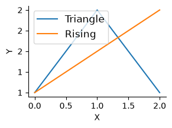

# safepyrun


<!-- WARNING: THIS FILE WAS AUTOGENERATED! DO NOT EDIT! -->

``` python
from fastcore.test import expect_fail,test_eq
import string,types,subprocess
```

## Helpers and setup

[`_find_frame_dict`](https://AnswerDotAI.github.io/safepyrun/core.html#_find_frame_dict)
walks the call stack looking for a frame whose globals contain
`sentinel`. This lets
[`RunPython`](https://AnswerDotAI.github.io/safepyrun/core.html#runpython)
find the caller’s namespace without requiring an explicit globals dict.
If no sentinel is found, it falls back to its own module globals.

``` python
_test_sentinel = True
d = _find_frame_dict('_test_sentinel')
assert '_test_sentinel' in d
d2 = _find_frame_dict('nonexistent_sentinel_xyz')
assert d2 is not None
```

``` python
_test_sentinel = True
d = _find_frame_dict('_test_sentinel')
assert '_test_sentinel' in d
d3 = _find_frame_dict('')
assert d3 is not None
```

------------------------------------------------------------------------

<a
href="https://github.com/AnswerDotAI/safepyrun/blob/main/safepyrun/core.py#L44"
target="_blank" style="float:right; font-size:smaller">source</a>

### find_var

``` python
def find_var(
    var:str
):
```

*Search for var in all frames of the call stack*

``` python
find_var('_test_sentinel')
```

    True

## Builtins and wrappers

------------------------------------------------------------------------

<a
href="https://github.com/AnswerDotAI/safepyrun/blob/main/safepyrun/core.py#L55"
target="_blank" style="float:right; font-size:smaller">source</a>

### freeze_mon_policy

``` python
def freeze_mon_policy(
    p
):
```

*Freeze monitoring policy for one run*

`mon_disable_policy` is mutable module-level configuration for cheap
`sys.monitoring` DISABLE decisions.
[`freeze_mon_policy`](https://AnswerDotAI.github.io/safepyrun/core.html#freeze_mon_policy)
snapshots it for a single run so policy checks are stable while code
executes.

------------------------------------------------------------------------

<a
href="https://github.com/AnswerDotAI/safepyrun/blob/main/safepyrun/core.py#L64"
target="_blank" style="float:right; font-size:smaller">source</a>

### on_call

``` python
def on_call(
    caller, callee, fn, code, off, data, calls
):
```

*Fast monitoring callback to decide if event should be DISABLEd*

[`on_call`](https://AnswerDotAI.github.io/safepyrun/core.html#on_call)
uses only caller/callee names, call pairs, prefixes/suffixes, and
optional predicates to decide whether this call site can be disabled for
performance. Since fastaudit raises audit events for sys.monitoring
c-call events, they can also be checked there when args/kwargs policy
checks are needed.

------------------------------------------------------------------------

<a
href="https://github.com/AnswerDotAI/safepyrun/blob/main/safepyrun/core.py#L73"
target="_blank" style="float:right; font-size:smaller">source</a>

### frame_args

``` python
def frame_args(
    fr, obj:NoneType=None
):
```

*Introspection helper used before audit denies an op; check whether it
happened inside an approved call*

Check on a plain function, including normal positional arguments,
keyword-only arguments, and extra `**kwargs`:

``` python
def some_tool(path, text, *, overwrite=False, **kwargs): return frame_args(currentframe())
args,kwargs = some_tool('path', 'text', overwrite=True, a='b')
test_eq(args, ['path', 'text'])
test_eq(kwargs, {'overwrite': True, 'a': 'b'})
```

With methods removes `self` from the returned positional arguments:

``` python
class F:
    def some_meth(self, path, text, *, overwrite=False, **kwargs): return frame_args(currentframe(), self)
args,kwargs = F().some_meth('path', 'text', overwrite=True, a='b')
test_eq(args, ['path', 'text'])
test_eq(kwargs, {'overwrite': True, 'a': 'b'})
```

``` python
list(_prefix_keys('a.b.cc'))
```

    ['a.b.*', 'a.*']

``` python
test_eq(_ctx_check(..., 'save', None, ['x'], {}, {}), None)
test_eq(_ctx_check({'save'}, 'save', None, ['x'], {}, {}), True)
test_eq(_ctx_check({'load'}, 'save', None, ['x'], {}, {}), False)
test_eq(_ctx_check({'load', ...}, 'save', None, ['x'], {}, {}), None)
```

``` python
seen = []
def ok(obj, a, kw, data): seen.append((obj, a, kw, data))
def bad(obj, a, kw, data): raise Exception('denied')

seen.clear()
test_eq(_ctx_check({('save', ok)}, 'save', None, ['x'], {'force': True}, {'d': 1}), True)
test_eq(seen, [(None, ['x'], {'force': True}, {'d': 1})])
with expect_fail(): _ctx_check({('save', bad)}, 'save', None, ['x'], {}, {})

class T: pass
t = T()
seen.clear()
test_eq(_ctx_check({('save', ok)}, 'save', t, [t, 'x'], {'force': True}, {'d': 1}), True)
test_eq(seen, [(t, ['x'], {'force': True}, {'d': 1})])
```

These three checkers share a three-valued protocol: `True` means a
registration explicitly allows the call, `False` means nothing matched,
and `None` is a soft match, from an allow-all (`...`) entry. Hard
results win over soft ones, so a `(name, policy)` registration keeps
first claim on its method even when a blanket `'pkg.*': ...` entry also
covers it: the policy’s verdict, `True` or a raised `PermissionError`,
is decided before the soft match is consulted.

[`_ctx_check`](https://AnswerDotAI.github.io/safepyrun/core.html#_ctx_check)
checks one pytool registration set for a matching name. Direct name
matches return `True`; for validator tuples it calls the validator with
`(obj, args, kwargs, data)`, returning `True` if it passes and
collecting denials into one `PermissionError` otherwise; allow-all
returns `None`. It exists so module, class, tracked-call, and frame-call
checks all share the same validator logic.

[`_call_allowed`](https://AnswerDotAI.github.io/safepyrun/core.html#_call_allowed)
checks one logical
[`CallInfo`](https://AnswerDotAI.github.io/safepyrun/core.html#callinfo)
against the pytool registry: at module level, by module-prefix keys
([`_prefix_keys`](https://AnswerDotAI.github.io/safepyrun/core.html#_prefix_keys)
turns `a.b.c` into `a.b.*` and `a.*`), for the specific bound instance,
and at class/MRO level. The first `True` wins; a soft match from any
level is remembered and returned as `None` only after every level has
had the chance to match hard. It exists to centralize pytool lookup for
both async tracked calls and stack-frame fallback calls.

[`_ctx_allowed`](https://AnswerDotAI.github.io/safepyrun/core.html#_ctx_allowed)
checks every logical call in a
[`DenyInfo`](https://AnswerDotAI.github.io/safepyrun/core.html#denyinfo).
It returns `True` if any call matches hard, else whether any call
matched softly, so a blanket allow anywhere in the stack still permits
the operation. It exists so
[`before_deny`](https://AnswerDotAI.github.io/safepyrun/core.html#before_deny)
no longer duplicates stack walking or call matching logic.

------------------------------------------------------------------------

<a
href="https://github.com/AnswerDotAI/safepyrun/blob/main/safepyrun/core.py#L167"
target="_blank" style="float:right; font-size:smaller">source</a>

### DenyInfo

``` python
def DenyInfo(
    event, args, frame, msg, data, calls, frame_args
):
```

*Initialize self. See help(type(self)) for accurate signature.*

------------------------------------------------------------------------

<a
href="https://github.com/AnswerDotAI/safepyrun/blob/main/safepyrun/core.py#L154"
target="_blank" style="float:right; font-size:smaller">source</a>

### CallInfo

``` python
def CallInfo(
    fn:NoneType=None, args:tuple=(), kwargs:NoneType=None, module:NoneType=None, qualname:NoneType=None,
    name:NoneType=None, frame:NoneType=None, source:NoneType=None
):
```

*Initialize self. See help(type(self)) for accurate signature.*

------------------------------------------------------------------------

<a
href="https://github.com/AnswerDotAI/safepyrun/blob/main/safepyrun/core.py#L151"
target="_blank" style="float:right; font-size:smaller">source</a>

### RawDenyInfo

``` python
def RawDenyInfo(
    args, frame, msg, calls, frame_args
):
```

*Initialize self. See help(type(self)) for accurate signature.*

[`DenyInfo`](https://AnswerDotAI.github.io/safepyrun/core.html#denyinfo)
is the public object passed to `pre_deny`. It exposes `event`, `data`,
`call`, `args`, `kwargs`, `calls`, `native_calls`, `tracked_calls`, and
`frame_calls`, with raw audit details under `raw`. For `fastaudit.call`
events, `native_calls` holds a
[`CallInfo`](https://AnswerDotAI.github.io/safepyrun/core.html#callinfo)
synthesized from the dotted callee name (a native callee has no Python
frame and no tracked call), so registrations for extension classes and
modules are checked too. It exists to make policy callbacks ergonomic
while preserving access to lower-level audit information when needed.

Instance keys let a registration target one specific callable instance
rather than a whole class — the case for dynamically-generated client
ops (e.g. fastspec’s `OpFunc`), where every op shares the same
`__call__`.
[`_call_allowed`](https://AnswerDotAI.github.io/safepyrun/core.html#_call_allowed)
probes the registry with the bound object itself (skipping unhashable
objects), so `allow(op)` permits that op alone:

``` python
class _Op:
    async def __call__(self, x): return x

op1,op2 = _Op(),_Op()
tst = dict(pytools={op1: {'__call__'}})
test_eq(_call_allowed(CallInfo(fn=_Op.__call__, args=(op1,'x'), module=__name__, qualname='_Op.__call__'), tst), True)
test_eq(_call_allowed(CallInfo(fn=_Op.__call__, args=(op2,'x'), module=__name__, qualname='_Op.__call__'), tst), False)

class _Unhashable:
    __hash__ = None
    def save(self): pass
test_eq(_call_allowed(CallInfo(fn=_Unhashable.save, args=(_Unhashable(),), module=__name__, qualname='_Unhashable.save'), tst), False)
```

------------------------------------------------------------------------

<a
href="https://github.com/AnswerDotAI/safepyrun/blob/main/safepyrun/core.py#L193"
target="_blank" style="float:right; font-size:smaller">source</a>

### before_deny

``` python
def before_deny(
    event, args, frame, msg, data, calls, pre_deny:NoneType=None, _frame_args:function=frame_args
):
```

*Check whether a possibly-denied audit event happened inside an approved
call.*

[`before_deny`](https://AnswerDotAI.github.io/safepyrun/core.html#before_deny)
is the audit-policy adapter called by `fastaudit`. It builds a
[`DenyInfo`](https://AnswerDotAI.github.io/safepyrun/core.html#denyinfo),
gives `pre_deny(info)` first refusal, then falls back to registered
pytool checks via
[`_ctx_allowed`](https://AnswerDotAI.github.io/safepyrun/core.html#_ctx_allowed).
It returns `True` to allow the audited operation, or `None` to leave it
denied by the audit layer.

Check direct allow-by-name:

``` python
tst_data = dict(pytools={sys.modules[__name__]: {'_bd_allowed'}}, ok_dests=set())
def _bd_allowed(): return before_deny(None, None, currentframe(), None, data=tst_data, calls=[])
def _bd_denied (): return before_deny(None, None, currentframe(), None, data=tst_data, calls=[])

assert _bd_allowed()
assert not _bd_denied()
```

Check the registered method passes its object, recovered args, kwargs,
and allowed destinations:

``` python
_seen = []
def _bd_check(obj, args, kw, data): _seen.append((obj, args, kw, data['ok_dests']))

class _BDT:
    def save(self, path, *, overwrite=False): return before_deny(None, None, currentframe(), None, data=tst_data, calls=[])
tst_data = dict(pytools={_BDT: [('save', _bd_check)]}, ok_dests={'/tmp'})

t = _BDT()
test_eq(t.save('/tmp/x', overwrite=True), True)
test_eq(_seen, [(t, ['/tmp/x'], dict(overwrite=True), {'/tmp'})])
```

``` python
def _deny(obj, a, kw, data): raise Exception('denied')

info = types.SimpleNamespace(
    calls=[
        CallInfo(module='matplotlib', qualname='pyplot.plot', name='matplotlib.pyplot.plot'),
        CallInfo(module='danger', qualname='save', name='danger.save')],
    data=dict(pytools={'matplotlib.*': ..., 'danger.*': {('save', _deny)}}))

with expect_fail(): _ctx_allowed(info)
```

A native callee (e.g. a cython method) leaves no Python frame and no
tracked call, so
[`DenyInfo`](https://AnswerDotAI.github.io/safepyrun/core.html#denyinfo)
synthesizes a
[`CallInfo`](https://AnswerDotAI.github.io/safepyrun/core.html#callinfo)
from the dotted callee name of a `fastaudit.call` event. This lets
`allow()` registrations for extension classes and modules apply to
direct native calls:

``` python
class _NativeT:
    def op(self): ...

tst_data = dict(pytools={_NativeT: {'op'}}, ok_dests=set())
assert before_deny('fastaudit.call', ('caller', f'{__name__}._NativeT.op', 'chain'), currentframe(), 'msg', tst_data, [])
assert not before_deny('fastaudit.call', ('caller', f'{__name__}._NativeT.other', 'chain'), currentframe(), 'msg', tst_data, [])
```

## Main implementation

------------------------------------------------------------------------

<a
href="https://github.com/AnswerDotAI/safepyrun/blob/main/safepyrun/core.py#L200"
target="_blank" style="float:right; font-size:smaller">source</a>

### srcfn

``` python
def srcfn(
    src
):
```

*Stores src in linecache under \<python\_{i%10}\>, returns the name.*

``` python
srcfn(''),srcfn('')
```

    ('<python_0>', '<python_1>')

------------------------------------------------------------------------

<a
href="https://github.com/AnswerDotAI/safepyrun/blob/main/safepyrun/core.py#L211"
target="_blank" style="float:right; font-size:smaller">source</a>

### \_\_run_python

``` python
async def __run_python(
    code:str, g:NoneType=None, ok_dests:NoneType=None
):
```

*Call self as a function.*

[`_run_python`](https://AnswerDotAI.github.io/safepyrun/core.html#_run_python)
builds the per-run policy bundle passed to `fastaudit`, including
approved pytools, allowed destinations, and the frozen monitoring policy
snapshot.

------------------------------------------------------------------------

<a
href="https://github.com/AnswerDotAI/safepyrun/blob/main/safepyrun/core.py#L236"
target="_blank" style="float:right; font-size:smaller">source</a>

### set_data

``` python
def set_data(
    **kw
):
```

*Set default entries for the per-run policy `data` dict;
per-[`RunPython`](https://AnswerDotAI.github.io/safepyrun/core.html#runpython)
kwargs win*

[`set_data`](https://AnswerDotAI.github.io/safepyrun/core.html#set_data)
supplies defaults for the extra `data` keys that allow policies read
(like `ok_urls` below), so hosts and the user config file can set them
once instead of per
[`RunPython`](https://AnswerDotAI.github.io/safepyrun/core.html#runpython)
instance. It raises a `safepyrun.set_data` audit event, so sandboxed
code calling it is denied.

[`_run_python`](https://AnswerDotAI.github.io/safepyrun/core.html#_run_python)
snapshots `asyncio.all_tasks()` before running and waits for any new
tasks (including tasks they spawn in turn) before returning, so a tool
call only completes when all its background work has. If a background
task fails, the tool call raises that error. Tasks spawned by tool code
with `asyncio.create_task` would otherwise outlive the audit context.

``` python
res = []
async def bg_job():
    await asyncio.sleep(0.1)
    res.append('finished')

r = await _run_python("asyncio.create_task(bg_job())\n'returned'", g=dict(asyncio=asyncio, bg_job=bg_job), ok_dests=())
test_eq(r, 'returned')
test_eq(res, ['finished'])  # bg task completed before the call returned
```

``` python
async def bg_bad():
    await asyncio.sleep(0.01)
    subprocess.run(['ls'])
    
with expect_fail(PermissionError, 'subprocess.Popen blocked'):
    await _run_python("asyncio.create_task(bg_bad())", g=dict(asyncio=asyncio, bg_bad=bg_bad), ok_dests=())
```

The helpers a host injects into user globals (python, allow) are never
exported back out of the sandbox, so AI code can’t shadow them with
trojans for the user to run later.

``` python
with expect_fail(PermissionError):
    await _run_python("allow_imports.add('evil')", g={'allow_imports': allow_imports})
allow_imports.discard('evil')
```

AI code can reach the mutable host policy (`__pytools__`,
`allow_imports`, `mon_disable_policy`) by importing this module, and
could loosen it for a later call.
[`_run_python`](https://AnswerDotAI.github.io/safepyrun/core.html#_run_python)
fingerprints that policy before running and raises if it changed by the
time the call finishes, so any in-call tampering fails loudly.

``` python
g = {}
await _run_python("python = 'trojan'\nallow = 'trojan'\nkeep = 42", g=g)
test_eq(g['keep'], 42)
assert 'python' not in g and 'allow' not in g
```

We have some extra rules based on the raw code being run (as opposed to
the code inside the implementations being called): - No imports - No
exec/eval - No defining functions or classes.
[`_check_user_code`](https://AnswerDotAI.github.io/safepyrun/core.html#_check_user_code)
is responsible for these rules.

Some libs (like `httpcore`) wrap our permission errors, so we can’t
handle them directly. We unwrap the error in that situation.

------------------------------------------------------------------------

<a
href="https://github.com/AnswerDotAI/safepyrun/blob/main/safepyrun/core.py#L309"
target="_blank" style="float:right; font-size:smaller">source</a>

### RunPython

``` python
def RunPython(
    g:NoneType=None, sentinel:NoneType=None, ok_dests:Unset=UNSET,
    ban_imports:frozenset=frozenset({'fastaudit', 'safepyrun', 'socket', 'importlib'}), ban_defs:bool=True,
    pre_deny:NoneType=None, yolo:bool=False, **kwargs
):
```

*Execute Python with audit-hook safety checks and access to LLM tools,
returning last expression.* `import` works in the usual way. All
builtins are available. Multiline code blocks can be used. By default,
defining functions or classes is *not* allowed (`ban_defs=True`);
construct
[`RunPython`](https://AnswerDotAI.github.io/safepyrun/core.html#runpython)
with `ban_defs=False` to permit them.

**Sandbox**: an audit hook blocks risky operations by default
(e.g. network), and `socket`/`importlib` imports are banned. To permit
one, the user must `allow()` a function that performs it from the real
Python process; sandboxed code cannot `allow()` itself. **NB**: Locals
are exported back to the caller’s namespace.

[`RunPython`](https://AnswerDotAI.github.io/safepyrun/core.html#runpython)
is the public API. It captures the caller’s globals via
[`_find_frame_dict`](https://AnswerDotAI.github.io/safepyrun/core.html#_find_frame_dict),
optionally takes `ok_dests` for write-checking, and executes code under
the audit-hook policy.

``` python
python = RunPython()
```

``` python
await python('[]')
```

    []

``` python
async def f(): return 1
```

``` python
await python('await f()')
```

    1

Passing an empty dict as the namespace results in a clean environment:

``` python
g = {}
await RunPython(g=g)('_ns_test_var = 42')
test_eq(list(g.keys()), ['_ns_test_var'])
assert '_ns_test_var' not in globals()
```

------------------------------------------------------------------------

<a
href="https://github.com/AnswerDotAI/safepyrun/blob/main/safepyrun/core.py#L347"
target="_blank" style="float:right; font-size:smaller">source</a>

### create_python_magic

``` python
def create_python_magic(
    shell:NoneType=None, python:NoneType=None, g:NoneType=None, sentinel:NoneType=None, ok_dests:Unset=UNSET,
    ban_imports:frozenset=frozenset({'fastaudit', 'safepyrun', 'socket', 'importlib'}), ban_defs:bool=True,
    pre_deny:NoneType=None, yolo:bool=False
):
```

*Create magic*

``` python
create_python_magic()
```

``` python
%%py
print('tt')
```

    tt

``` python
%%py
type('t')
```

    str

``` python
%%py
a = 1
a+=2
a
```

    3

Unpacking is allowed:

``` python
%%py
a = [1,2,3]
print(*a)
```

    1 2 3

``` python
def f(): warnings.warn('a warning')
```

``` python
%%py
print("asdf")
f()
1+1
```

    asdf

    /var/folders/51/b2_szf2945n072c0vj2cyty40000gn/T/kernmini_7541/3833129470.py:1: UserWarning: a warning
      def f(): warnings.warn('a warning')

    2

Classes and functions can not be created:

``` python
with expect_fail(PermissionError):
    await python('class A:\n    def __init__(self): print("hi")')

with expect_fail(PermissionError):
    await python('def f(): print("hi")')
```

``` python
with expect_fail(PermissionError): await python('os.system("ls")')
```

``` python
%%py
print(os.unlink)
print(type(os.unlink))
print(os.unlink.__qualname__)
```

    <built-in function unlink>
    <class 'builtin_function_or_method'>
    unlink

``` python
class C: ...
c = C()
```

``` python
%%py
isinstance(C, type)
```

    True

``` python
%%py
isinstance(c, type)
```

    False

``` python
async def f(): return 1
```

``` python
%%py
await f()
```

    1

### `allow_write_types`

``` python
o = SimpleNamespace(x=1)

await python('''
d = {}
d["x"] = 1
o.x = 2
d["x"],o.x''')
```

    (1, 2)

## Config

`safepyrun` loads an optional user config from
`{xdg_config_home}/safepyrun/config.py` at import time, after all
defaults are registered. This lets users permanently extend the sandbox
allowlists without modifying the package. The config file is executed
with all `safepyrun.core` globals already available — no imports needed.
This includes `allow`,
[`set_data`](https://AnswerDotAI.github.io/safepyrun/core.html#set_data),
`allow_write_types`, `AllowPolicy`, `PathWritePolicy`, `PosAllowPolicy`,
`OpenWritePolicy`, and all standard library modules already imported by
the module.

Example `~/.config/safepyrun/config.py` (Linux) or
`~/Library/Application Support/safepyrun/config.py` (macOS):

``` python
# Add pandas tools
allow({pandas.DataFrame: ['head', 'describe', 'info', 'shape']})

# Allow writes under these directories by default
default_ok_dests = ['.', '/tmp']

# Default policy data for allow policies (e.g. chk_url-style URL checks)
set_data(ok_urls={'http://example.org'})
```

Registrations made by calling functions (`allow`,
[`set_data`](https://AnswerDotAI.github.io/safepyrun/core.html#set_data))
take effect directly. Assignments only work for `default_ok_dests`,
which the loader copies back explicitly.

If the config file has errors, a warning is emitted and the defaults
remain intact.

## Examples

``` python
%%py
a = {"b":1}
list(a.items())
```

    [('b', 1)]

``` python
%%py
Path().exists()
```

    True

``` python
%%py
os.path.join('/foo', 'bar', 'baz.py')
```

    '/foo/bar/baz.py'

``` python
%%py
a_=3
```

``` python
a_
```

    3

``` python
%%py
aa_='33'
```

``` python
%%py
len(aa_)
```

    2

``` python
def g(): ...
```

``` python
%%py
inspect.getsource(g)
```

    'def g(): ...\n'

``` python
with expect_fail(PermissionError): await python("os.unlink('/foo/bar')")
```

``` python
async def agen():
    for x in [1,2]: yield x
```

``` python
%%py
res = []
async for x in agen(): res.append(x)
res
```

    [1, 2]

``` python
import asyncio
async def fetch(n): return n * 10
```

``` python
%%py
print(string.ascii_letters)
await asyncio.gather(fetch(1), fetch(2), fetch(3))
```

    abcdefghijklmnopqrstuvwxyzABCDEFGHIJKLMNOPQRSTUVWXYZ

    [10, 20, 30]

``` python
import numpy as np
```

``` python
%%py
np.array([1,2,3]).sum()
```

    np.int64(6)

### Allow policy examples

``` python
python2 = RunPython(ok_dests=['/tmp'])
```

``` python
await python2("Path('/tmp/test_write.txt').write_text('hello')")
```

    5

``` python
await python2("open('/tmp/test_open.txt', 'w').write('hi')")
```

    2

``` python
with expect_fail(PermissionError): await python2("Path('/etc/evil.txt').write_text('bad')")
with expect_fail(PermissionError): await python2("open('/root/bad.txt', 'w')")
```

``` python
await python2("open('/etc/passwd', 'r').read(10)")
```

    '##\n# User '

``` python
await python2("import shutil; shutil.copy('/tmp/test_write.txt', '/tmp/test_copy.txt')")
```

    '/tmp/test_copy.txt'

``` python
with expect_fail(PermissionError): await python2("import shutil; shutil.copy('/tmp/test_write.txt', '/root/bad.txt')")
with expect_fail(PermissionError): await python("Path('/tmp/test.txt').write_text('nope')")
```

``` python
python_cwd = RunPython(ok_dests=['.'])

# Writing to cwd should work
await python_cwd("Path('test_cwd_ok.txt').write_text('hello')")
```

    5

``` python
with expect_fail(PermissionError): await python("Path('test_cwd_ok.txt').write_text('hello')")
```

``` python
Path('test_cwd_ok.txt').unlink(missing_ok=True)
```

``` python
# Writing to /tmp should be blocked (not in ok_dests)
with expect_fail(PermissionError): await python_cwd("Path('/tmp/nope.txt').write_text('bad')")
```

``` python
# Parent traversal should be blocked
with expect_fail(PermissionError): await python_cwd("Path('../escape.txt').write_text('bad')")
```

``` python
# Sneaky traversal via subdir/../../ should also be blocked
with expect_fail(PermissionError): await python_cwd("Path('subdir/../../escape.txt').write_text('bad')")
```

## `allow`

Registration gates *effects*, not name lookup: plain Python with no
guarded side effects runs without being registered. `allow` matters for
callables whose implementation needs an otherwise-denied operation
(subprocess, network, writes, audit events):

``` python
def pure(name): return f"Hello, {name}!"
test_eq(await python('pure("World")'), 'Hello, World!')
```

``` python
class A:
    def f(self): ...

def g(self:A): ...
```

``` python
import fastcore.basics
```

``` python
__pytools__.pop(fastcore.basics, None);
```

``` python
with expect_fail(PermissionError): await python("patch(g)")
```

``` python
assert await python("patch(g)")
```

``` python
def trusted_echo(): return subprocess.run(['echo', 'hi'], capture_output=True, text=True)
```

``` python
with expect_fail(PermissionError): await python("trusted_echo().stdout")
with expect_fail(PermissionError): await python("import subprocess; subprocess.run(['echo', 'hi'])")
```

``` python
allow(trusted_echo)
test_eq((await python("trusted_echo().stdout")), "hi\n")
with expect_fail(PermissionError): await python("import subprocess; subprocess.run(['echo', 'hi'])")
```

``` python
class _MethT:
    def echo (self): return run('echo hi')
    def echo2(self): return run('echo hi')

t = _MethT()
with expect_fail(PermissionError): await python("t.echo()")
with expect_fail(PermissionError): await python("t.echo2()")
allow(_MethT.echo)
test_eq(await python("t.echo()"), "hi")

allow({_MethT:['echo2']})
test_eq(await python("t.echo2()"), "hi")
```

``` python
@patch
def echo3(self:_MethT): return run('echo hi')
with expect_fail(PermissionError): await python("t.echo3()")
allow({_MethT:['echo3']})
test_eq(await python("t.echo3()"), "hi")
```

Callable instances are registered under the instance itself, so each one
is allowed individually. This is the pattern for dynamically-generated
client ops (e.g. fastspec’s `OpFunc`), where every op shares the same
class and `__call__`:

``` python
class _OpT:
    def __init__(self,name): store_attr()
    def __call__(self): return run('echo hi')

op_a,op_b,op_c = _OpT('a'),_OpT('b'),_OpT('c')
with expect_fail(PermissionError): await python("op_a()")
allow(op_a)
test_eq(await python("op_a()"), "hi")
with expect_fail(PermissionError): await python("op_b()")
```

Instead of allowing individual instances of `OpFunc` where the list can
grow, allow policies can be used to allow at a higher level
(e.g. checking `obj.base_url` of `OpenAPIClient`). Policies are additive
and `AllowPolicy` will raise when none of the policies allow:

``` python
__pytools__.pop(op_a,None);
```

``` python
class AllowOpTA(AllowPolicy):
    def __call__(self, obj, args, kwargs, data):
        if 'a' not in obj.name : raise PermissionError(f'Only "a" is allowed not: {obj.name}')
allow({_OpT:[('__call__', AllowOpTA())]})
```

``` python
test_eq(await python("op_a()"), "hi")
with expect_fail(PermissionError): await python("op_b()")
```

``` python
class AllowOpTB(AllowPolicy):
    def __call__(self, obj, args, kwargs, data):
        if 'b' not in obj.name : raise PermissionError(f'Only "b" is allowed not: {obj.name}')
allow({_OpT:[('__call__', AllowOpTB())]})
```

``` python
test_eq(await python("op_b()"), "hi")
with expect_fail(PermissionError, 'Only "a" is allowed not: c; Only "b" is allowed not: c'): await python("op_c()")
```

``` python
import httpx
```

``` python
with expect_fail(PermissionError): await python('httpx.get("http://example.org")')
```

``` python
@allow
def getexample(): return httpx.get('http://example.org')
```

``` python
await python('getexample()')
```

    <Response [200 OK]>

``` python
def testevent():
    sys.audit('python.testevent')
    return 'ok'
```

``` python
with expect_fail(PermissionError): await python('testevent()')
```

``` python
@allow
def testevent2():
    return testevent()
```

``` python
%%py
testevent2()
```

    'ok'

``` python
def chk_url(obj, args, kw, data):
    url = args[0] if args else kw.get('url','')
    if url not in data.get('ok_urls', ()): raise PermissionError(url)
```

``` python
python_urls = RunPython(ok_urls={'http://example.org'})
```

``` python
allow({httpx.get: chk_url})
with expect_fail(PermissionError): await python_urls('httpx.get("http://example.com")')
await python_urls('httpx.get("http://example.org")')
```

    <Response [200 OK]>

[`set_data`](https://AnswerDotAI.github.io/safepyrun/core.html#set_data)
sets those keys as global defaults, so any plain
[`RunPython`](https://AnswerDotAI.github.io/safepyrun/core.html#runpython)
picks them up; per-instance kwargs still override:

``` python
set_data(ok_urls={'http://example.org'})
await RunPython()('httpx.get("http://example.org")')
```

    <Response [200 OK]>

``` python
@allow
def _httpget(url): return httpx.get(url)
```

``` python
def httpget(url):
    sys.audit('myapp.httpget', url)
    return _httpget(url)
```

``` python
def url_allow(info):
    if info.event=='myapp.httpget' and info.raw.args[0] in info.data.get('ok_urls', ()): return True
```

``` python
python_urls2 = RunPython(pre_deny=url_allow, ok_urls={'http://example.org'})
with expect_fail(PermissionError): await python_urls2('httpget("http://example.com")')
await python_urls2('httpget("http://example.org")')
```

    <Response [200 OK]>

Sandboxed code can’t loosen policy for later runs. `allow` and
[`set_data`](https://AnswerDotAI.github.io/safepyrun/core.html#set_data)
raise audit events (`pyskills.allow`, `safepyrun.set_data`), which are
denied inside a run like any other unapproved operation:

``` python
with expect_fail(PermissionError): await python('allow(print)')
with expect_fail(PermissionError): await python('set_data(ok_dests=["/"])')
```

Mutating the policy registries directly raises no audit event, so it
can’t be blocked up front; instead the policy fingerprint catches it
when the run ends, before any later call would use the tampered state:

``` python
with expect_fail(PermissionError, 'policy changed'): await python("__pytools__[str].add('lower')")
__pytools__.pop(str, None)
```

    {'lower'}

## Plots and Pandas

------------------------------------------------------------------------

<a
href="https://github.com/AnswerDotAI/safepyrun/blob/main/safepyrun/core.py#L375"
target="_blank" style="float:right; font-size:smaller">source</a>

### allow_matplotlib

``` python
def allow_matplotlib():
```

*Call self as a function.*

``` python
import matplotlib.pyplot as plt
from matplotlib.figure import Figure
from matplotlib.axes import Axes
from matplotlib.axis import Axis
from matplotlib.spines import Spine, SpinesProxy
```

``` python
allow_matplotlib()
```

``` python
%%py
fig, ax = plt.subplots(figsize=(3,2), dpi=100)
ax.plot([1,2,1], label='Triangle')
ax.plot([1,1.5,2], label='Rising')
ax.tick_params(labelsize=10)
ax.set_xlabel('X', fontsize=10)
ax.set_ylabel('Y', fontsize=10)
ax.spines[['top','right']].set_visible(False)
ax.yaxis.set_major_formatter('{x:.0f}')
ax.legend(fontsize=12);
```



``` python
python_tmp = RunPython(ok_dests=['/tmp'])
with expect_fail(PermissionError): await python_tmp("fig.savefig(os.path.expanduser('~/plot.png'))")
await python_tmp("fig.savefig('/tmp/plot.png')")
```

------------------------------------------------------------------------

<a
href="https://github.com/AnswerDotAI/safepyrun/blob/main/safepyrun/core.py#L384"
target="_blank" style="float:right; font-size:smaller">source</a>

### allow_pandas

``` python
def allow_pandas():
```

*Call self as a function.*

``` python
import pandas as pd
```

``` python
df = pd.DataFrame(data={'col1':[1,1,1,2,2],'col2':['George','Tim','Anna','Bob','Jon']})
```

``` python
python_pd = RunPython(ok_dests=['/tmp'])
with expect_fail(PermissionError): await python_pd('df.to_csv("/tmp/foo.csv")')
```

``` python
allow_pandas()
```

``` python
await python_pd('df.to_csv("/tmp/foo.csv")')
with expect_fail(PermissionError): await python_pd('df.to_csv("~/foo.csv")')
```

``` python
await python_pd('df.to_csv("/tmp/foo.csv")')
await python_pd('df.to_json(path_or_buf="/tmp/foo.json")')
with expect_fail(PermissionError): await python_pd('df.to_csv("~/foo.csv")')
with expect_fail(PermissionError): await python_pd('df.to_json(path_or_buf="~/foo.json")')
```

Confinement doesn’t depend on that list of methods being complete.
[`allow_pandas()`](https://AnswerDotAI.github.io/safepyrun/core.html#allow_pandas)
grants pandas no blanket trust, so a write pandas makes through a route
it never registered is checked against `ok_dests` like any other write:

``` python
await python_pd("pd.io.common.get_handle('/tmp/raw.txt','w').close()")
with expect_fail(PermissionError): await python_pd("pd.io.common.get_handle('~/raw.txt','w')")
```

## Extension

------------------------------------------------------------------------

<a
href="https://github.com/AnswerDotAI/safepyrun/blob/main/safepyrun/core.py#L399"
target="_blank" style="float:right; font-size:smaller">source</a>

### load_ipython_extension

``` python
def load_ipython_extension(
    ip
):
```

*Call self as a function.*

------------------------------------------------------------------------

<a
href="https://github.com/AnswerDotAI/safepyrun/blob/main/safepyrun/core.py#L411"
target="_blank" style="float:right; font-size:smaller">source</a>

### cli

``` python
def cli(
    path:Annotated, # Path to script, or '-' for stdin
):
```

*Run a python script file in the safepyrun sandbox*
