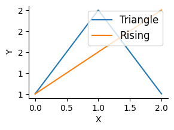

# safepython


<!-- WARNING: THIS FILE WAS AUTOGENERATED! DO NOT EDIT! -->

``` python
from fastcore.test import test_eq, test_fail
import string
```

## Helpers and setup

[`_find_frame_dict`](https://AnswerDotAI.github.io/safepyrun/core.html#_find_frame_dict)
walks the call stack looking for a frame whose globals contain
`sentinel`. This lets
[`RunPython`](https://AnswerDotAI.github.io/safepyrun/core.html#runpython)
find the caller’s namespace without requiring an explicit globals dict.
If no sentinel is found, it falls back to its own module globals.

``` python
_test_sentinel = True
d = _find_frame_dict('_test_sentinel')
assert '_test_sentinel' in d
d2 = _find_frame_dict('nonexistent_sentinel_xyz')
assert d2 is not None
```

------------------------------------------------------------------------

<a
href="https://github.com/AnswerDotAI/safepyrun/blob/main/safepyrun/core.py#L42"
target="_blank" style="float:right; font-size:smaller">source</a>

### find_var

``` python

def find_var(
    var:str
):

```

*Search for var in all frames of the call stack*

``` python
find_var('_test_sentinel')
```

    True

When `ok_dests` is set,
[`_get_write_policy`](https://AnswerDotAI.github.io/safepyrun/noaudit.html#_get_write_policy)
walks the MRO looking for tuple entries.

``` python
allow({str: [('test_method', AllowPolicy())]})
assert any(isinstance(x, tuple) and x[0] == 'test_method' for x in __pytools__[str])
__pytools__[str].discard(('test_method', AllowPolicy()))
```

[`_AllowChecked`](https://AnswerDotAI.github.io/safepyrun/noaudit.html#_allowchecked)
wraps a method so that its `WritePolicy` is enforced before the actual
call.

``` python
wc = _AllowChecked(Path('/tmp'), Path.exists, PathWritePolicy(), ['/tmp'])
assert callable(wc)
wc2 = _AllowChecked(Path('/etc'), Path('/etc').exists, PathWritePolicy(), ['/tmp'])
try: wc2()
except PermissionError: print("AllowChecked correctly blocked /etc")
```

    AllowChecked correctly blocked /etc

## Builtins and wrappers

[`_cls_ok`](https://AnswerDotAI.github.io/safepyrun/noaudit.html#_cls_ok)
checks at access time by walking the object and its MRO.
[`_name_in`](https://AnswerDotAI.github.io/safepyrun/noaudit.html#_name_in)
handles both plain strings and tuple entries.

[`_get_policy`](https://AnswerDotAI.github.io/safepyrun/noaudit.html#_get_policy)
extracts a `WritePolicy` from a tuple entry if present.

[`_DirectPrint`](https://AnswerDotAI.github.io/safepyrun/noaudit.html#_directprint)
is a no-op wrapper that RestrictedPython’s `_print_` and `_print` hooks
delegate to. It simply calls the real `print`, bypassing
RestrictedPython’s default print interception.

[`_callable_ok`](https://AnswerDotAI.github.io/safepyrun/noaudit.html#_callable_ok)
checks whether a callable should be allowed — it’s ok if it’s in
`__llmtools__`, is a key in `__pytools__`, or its module has its
`__qualname__` registered via
[`_cls_ok`](https://AnswerDotAI.github.io/safepyrun/noaudit.html#_cls_ok).

------------------------------------------------------------------------

<a
href="https://github.com/AnswerDotAI/safepyrun/blob/main/safepyrun/noaudit.py#L247"
target="_blank" style="float:right; font-size:smaller">source</a>

### should_export

``` python

def should_export(
    k, v, g
):

```

*True if sandbox local `k` with value `v` should be exported back to
caller globals `g`*

------------------------------------------------------------------------

<a
href="https://github.com/AnswerDotAI/safepyrun/blob/main/safepyrun/noaudit.py#L203"
target="_blank" style="float:right; font-size:smaller">source</a>

### SafeTransformer

``` python

def SafeTransformer(
    errors:NoneType=None, warnings:NoneType=None, used_names:NoneType=None
):

```

*A :class:`NodeVisitor` subclass that walks the abstract syntax tree
and* allows modification of nodes.

The `NodeTransformer` will walk the AST and use the return value of the
visitor methods to replace or remove the old node. If the return value
of the visitor method is `None`, the node will be removed from its
location, otherwise it is replaced with the return value. The return
value may be the original node in which case no replacement takes place.

Here is an example transformer that rewrites all occurrences of name
lookups (`foo`) to `data['foo']`::

class RewriteName(NodeTransformer):

       def visit_Name(self, node):
           return Subscript(
               value=Name(id='data', ctx=Load()),
               slice=Constant(value=node.id),
               ctx=node.ctx
           )

Keep in mind that if the node you’re operating on has child nodes you
must either transform the child nodes yourself or call the
:meth:`generic_visit` method for the node first.

For nodes that were part of a collection of statements (that applies to
all statement nodes), the visitor may also return a list of nodes rather
than just a single node.

Usually you use the transformer like this::

node = YourTransformer().visit(node)

------------------------------------------------------------------------

<a
href="https://github.com/AnswerDotAI/safepyrun/blob/main/safepyrun/core.py#L64"
target="_blank" style="float:right; font-size:smaller">source</a>

### on_call

``` python

def on_call(
    caller, callee, fn, code, off, data
):

```

*Call self as a function.*

------------------------------------------------------------------------

<a
href="https://github.com/AnswerDotAI/safepyrun/blob/main/safepyrun/core.py#L88"
target="_blank" style="float:right; font-size:smaller">source</a>

### before_deny

``` python

def before_deny(
    event, args, frame, msg, data
):

```

*Call self as a function.*

## Main implementation

------------------------------------------------------------------------

<a
href="https://github.com/AnswerDotAI/safepyrun/blob/main/safepyrun/core.py#L115"
target="_blank" style="float:right; font-size:smaller">source</a>

### srcfn

``` python

def srcfn(
    src
):

```

*Stores src in linecache under \<pyrun\_{i%10}\>, returns the name.*

``` python
srcfn(''),srcfn('')
```

    ('<pyrun_0>', '<pyrun_1>')

------------------------------------------------------------------------

<a
href="https://github.com/AnswerDotAI/safepyrun/blob/main/safepyrun/core.py#L133"
target="_blank" style="float:right; font-size:smaller">source</a>

### \_\_run_python

``` python

async def __run_python(
    code:str, g:NoneType=None, ok_dests:NoneType=None
):

```

*Call self as a function.*

[`_run_python`](https://AnswerDotAI.github.io/safepyrun/core.html#_run_python)
is the core sandbox executor. It compiles code with
[`SafeTransformer`](https://AnswerDotAI.github.io/safepyrun/noaudit.html#safetransformer),
sets up the restricted globals (builtins, getattr hook, tools), handles
the last-expression-as-return-value pattern, captures stdout/stderr, and
exports locals back to the caller’s namespace (unless they’d shadow an
existing callable or module; `_`-suffixed names always export).

------------------------------------------------------------------------

<a
href="https://github.com/AnswerDotAI/safepyrun/blob/main/safepyrun/core.py#L158"
target="_blank" style="float:right; font-size:smaller">source</a>

### RunPython

``` python

def RunPython(
    g:NoneType=None, sentinel:NoneType=None, ok_dests:Unset=UNSET
):

```

*Execute restricted Python with access to LLM tools, returning last
expression.* `import` works in the usual way. All builtins are
available. Multiline code blocks can be used, including defining
functions and variables, for use within the call.

**NB**: Locals are exported back to the caller’s namespace unless they’d
shadow an existing callable or module. - Symbols ending with `_` are
always exported, even if they shadow existing names. Examples:
`len([1,2,3])` (builtin); `add_msg(content="hi")` (tool); `df.shape`
(non-callable attr); `[x**2 for x in range(5)]` (last expression
returned); `sorted(my_dict.items())` (builtin + non-callable attr)

[`RunPython`](https://AnswerDotAI.github.io/safepyrun/core.html#runpython)
is the public API. It captures the caller’s globals via
[`_find_frame_dict`](https://AnswerDotAI.github.io/safepyrun/core.html#_find_frame_dict),
optionally takes `ok_dests` for write-checking, and generates its
docstring dynamically from the current `__llmtools__|__pytools__` set so
the LLM always sees an up-to-date tool list.

``` python
pyrun = RunPython()
```

``` python
await pyrun('[]')
```

    []

------------------------------------------------------------------------

<a
href="https://github.com/AnswerDotAI/safepyrun/blob/main/safepyrun/core.py#L182"
target="_blank" style="float:right; font-size:smaller">source</a>

### create_pyrun_magic

``` python

def create_pyrun_magic(
    shell:NoneType=None, pyrun:NoneType=None
):

```

*Create magic*

``` python
create_pyrun_magic()
```

``` python
print('tt')
```

    tt

``` python
type('t')
```

    str

``` python
a = 1
a+=2
a
```

    3

Unpacking is allowed:

``` python
a = [1,2,3]
print(*a)
```

    1 2 3

``` python
def f(): warnings.warn('a warning')
```

``` python
print("asdf")
f()
1+1
```

    asdf

    /var/folders/51/b2_szf2945n072c0vj2cyty40000gn/T/ipykernel_55925/3833129470.py:1: UserWarning: a warning
      def f(): warnings.warn('a warning')

    2

Classes and functions can be created:

``` python
await pyrun('''
class A:
    def __init__(self): print('safe')
_ = A()''')
```

    safe

``` python
await pyrun('''
def f(): print('safe')
f()''')
```

    safe

``` python
with expect_fail(PermissionError): await pyrun('os.system("ls")')
```

Unsafe code inside functions and classes is caught:

``` python
with expect_fail(PermissionError):
    await pyrun('''
class A:
    def __init__(self): os.unlink('/unsafe')
A()''')
```

``` python
with expect_fail(PermissionError):
    await pyrun('''
def f(): os.unlink('/unsafe')
f()''')
```

``` python
print(os.unlink)
print(type(os.unlink))
print(os.unlink.__qualname__)
```

    <built-in function unlink>
    <class 'builtin_function_or_method'>
    unlink

``` python
class C: ...
c = C()
```

``` python
isinstance(C, type)
```

    True

``` python
isinstance(c, type)
```

    False

### [`allow_write_types`](https://AnswerDotAI.github.io/safepyrun/noaudit.html#allow_write_types)

``` python
o = SimpleNamespace(x=1)

await pyrun('''
d = {}
d["x"] = 1
o.x = 2
d["x"],o.x''')
```

    (1, 2)

## Config

`safepyrun` loads an optional user config from
`{xdg_config_home}/safepyrun/config.py` at import time, after all
defaults are registered. This lets users permanently extend the sandbox
allowlists without modifying the package. The config file is executed
with all `safepyrun.core` globals already available — no imports needed.
This includes `allow`,
[`allow_write_types`](https://AnswerDotAI.github.io/safepyrun/noaudit.html#allow_write_types),
`AllowPolicy`, `PathWritePolicy`, `PosAllowPolicy`, `OpenWritePolicy`,
and all standard library modules already imported by the module.

Example `~/.config/safepyrun/config.py` (Linux) or
`~/Library/Application Support/safepyrun/config.py` (macOS):

``` python
# Add pandas tools
allow({pandas.DataFrame: ['head', 'describe', 'info', 'shape']})
```

If the config file has errors, a warning is emitted and the defaults
remain intact.

## Examples

``` python
a = {"b":1}
list(a.items())
```

    [('b', 1)]

``` python
Path().exists()
```

    True

``` python
os.path.join('/foo', 'bar', 'baz.py')
```

    '/foo/bar/baz.py'

``` python
a_=3
```

``` python
a_
```

    3

``` python
aa_='33'
```

``` python
len(aa_)
```

    2

``` python
def g(): ...
```

``` python
a=3
```

``` python
def a(): ...
```

Callables can’t shadow existing symbols:

``` python
test_eq(a, 3)
```

``` python
inspect.getsource(g)
```

    'def g(): ...\n'

``` python
with expect_fail(PermissionError): await pyrun("os.unlink('/foo/bar')")
```

``` python
async def agen():
    for x in [1,2]: yield x
res = []
async for x in agen(): res.append(x)
res
```

    [1, 2]

``` python
import asyncio
async def fetch(n): return n * 10
print(string.ascii_letters)
await asyncio.gather(fetch(1), fetch(2), fetch(3))
```

    abcdefghijklmnopqrstuvwxyzABCDEFGHIJKLMNOPQRSTUVWXYZ

    [10, 20, 30]

``` python
import numpy as np
```

``` python
np.array([1,2,3]).sum()
```

    np.int64(6)

### Allow policy examples

``` python
pyrun2 = RunPython(ok_dests=['/tmp'])
```

``` python
await pyrun2("Path('/tmp/test_write.txt').write_text('hello')")
```

    5

``` python
await pyrun2("open('/tmp/test_open.txt', 'w').write('hi')")
```

    2

``` python
with expect_fail(PermissionError): await pyrun2("Path('/etc/evil.txt').write_text('bad')")
with expect_fail(PermissionError): await pyrun2("open('/root/bad.txt', 'w')")
```

``` python
await pyrun2("open('/etc/passwd', 'r').read(10)")
```

    '##\n# User '

``` python
await pyrun2("import shutil; shutil.copy('/tmp/test_write.txt', '/tmp/test_copy.txt')")
```

    '/tmp/test_copy.txt'

``` python
with expect_fail(PermissionError): await pyrun2("import shutil; shutil.copy('/tmp/test_write.txt', '/root/bad.txt')")
with expect_fail(PermissionError): await pyrun("Path('/tmp/test.txt').write_text('nope')")
```

``` python
pyrun_cwd = RunPython(ok_dests=['.'])

# Writing to cwd should work
await pyrun_cwd("Path('test_cwd_ok.txt').write_text('hello')")
```

    5

``` python
with expect_fail(PermissionError): await pyrun("Path('test_cwd_ok.txt').write_text('hello')")
```

``` python
Path('test_cwd_ok.txt').unlink(missing_ok=True)
```

``` python
# Writing to /tmp should be blocked (not in ok_dests)
with expect_fail(PermissionError): await pyrun_cwd("Path('/tmp/nope.txt').write_text('bad')")
```

``` python
# Parent traversal should be blocked
with expect_fail(PermissionError): await pyrun_cwd("Path('../escape.txt').write_text('bad')")
```

``` python
# Sneaky traversal via subdir/../../ should also be blocked
with expect_fail(PermissionError): await pyrun_cwd("Path('subdir/../../escape.txt').write_text('bad')")
```

## `allow`

``` python
def trusted_echo(): return subprocess.run(['echo', 'hi'], capture_output=True, text=True)
```

``` python
with expect_fail(PermissionError): await pyrun("trusted_echo().stdout")
with expect_fail(PermissionError): await pyrun("import subprocess; subprocess.run(['echo', 'hi'])")
```

``` python
allow(trusted_echo)
test_eq((await pyrun("trusted_echo().stdout")), "hi\n")
with expect_fail(PermissionError): await pyrun("import subprocess; subprocess.run(['echo', 'hi'])")
```

## Plots

------------------------------------------------------------------------

<a
href="https://github.com/AnswerDotAI/safepyrun/blob/main/safepyrun/core.py#L208"
target="_blank" style="float:right; font-size:smaller">source</a>

### allow_matplotlib

``` python

def allow_matplotlib(
    
):

```

*Call self as a function.*

``` python
import matplotlib.pyplot as plt
from matplotlib.figure import Figure
from matplotlib.axes import Axes
from matplotlib.axis import Axis
from matplotlib.spines import Spine, SpinesProxy
```

``` python
allow_matplotlib()
```

``` python
fig, ax = plt.subplots(figsize=(3,2), dpi=100)
ax.plot([1,2,1], label='Triangle')
ax.plot([1,1.5,2], label='Rising')
ax.tick_params(labelsize=10)
ax.set_xlabel('X', fontsize=10)
ax.set_ylabel('Y', fontsize=10)
ax.spines[['top','right']].set_visible(False)
ax.yaxis.set_major_formatter('{x:.0f}')
ax.legend(fontsize=12);
```



``` python
pyrun_tmp = RunPython(ok_dests=['/tmp'])
with expect_fail(PermissionError): await pyrun_tmp("fig.savefig(os.path.expanduser('~/plot.png'))")
await pyrun_tmp("fig.savefig('/tmp/plot.png')")
```
